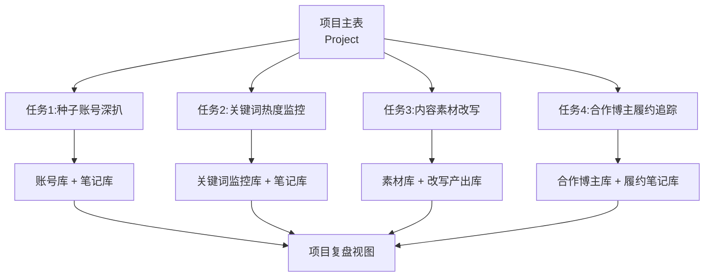

### **业务本质是"项目"为最小颗粒度的四类任务编排：种子账号深扒、关键词热度监控、内容素材改写、合作博主履约追踪——四类任务共用底层数据资产，但抓取策略、更新频率、输出形态完全不同**

你这次的梳理把业务讲得更清楚了，之前我画的"账号库为中心"的结构是对的，但缺了一个非常关键的维度——**"项目"**。所有抓取动作都不是孤立的，而是挂在某个项目下的子任务。下面我按你列的四个场景，把数据模型和任务编排重新对齐一遍。

---

### **一、核心认知升级:加入"项目"作为顶层容器**

项目是这套体系的最高层级,**一个项目对应一次品牌投放战役**(比如"北京车展""618美妆""新品上市")。每个项目下挂载四类任务,任务产生的数据通过`项目ID`聚合,这样才能做项目维度的复盘和ROI核算。

更新后的数据流是这样的:

---

### **二、新增"项目主表"作为顶层**

在原来五张表之上,加一张**项目主表(Project_Master)**,所有子任务表都通过`项目ID`关联到它。

| 字段名 | 类型 | 说明 |
|---|---|---|
| 项目ID | 自增编号(主键) | 如P202605001 |
| 项目名称 | 文本 | 如"北京车展2026" |
| 客户/品牌 | 单选 | |
| 项目周期 | 日期范围 | |
| 项目类型 | 多选 | 新品上市/节点营销/常态运营 |
| 目标赛道 | 多选 | 探店/汽车/美妆等 |
| 种子账号 | 双向关联→账号库 | 投前喂养的3-5个正样本 |
| 监控关键词 | 多行文本 | |
| 合作博主名单 | 双向关联→合作博主库 | |
| 项目状态 | 单选 | 筹备/进行中/已结案 |
| 负责人 | 人员字段 | |

有了项目表之后,**所有子表都要新增一个"所属项目"字段**(双向关联到项目主表),这样数据天然按项目隔离,不会串。

---

### **三、四类任务的数据模型与抓取策略**

#### **任务1:种子账号深扒(投前选号)**

**业务逻辑**:基于种子账号找相似 → 批量抓取候选账号近xx条笔记 → 多维表格做内容质量分析

**数据流向**:写入 `账号库` + `笔记库`,两张表通过`账号ID`关联,且都打上`所属项目`标签

**抓取策略**:
- **触发方式**:手动触发,项目启动时跑一次,后续按需补抓
- **抓取深度**:每个账号近30/50/100条笔记(可配置)
- **更新频率**:一次性抓取,后续不主动更新(账号本身的粉丝数、互动率可以走任务4的定时刷新)

**关键字段补充**(在原账号库基础上加):

| 新增字段 | 说明 |
|---|---|
| 所属项目 | 双向关联→项目主表 |
| 推荐来源 | 单选:种子相似/关键词命中/手动添加 |
| 相似度得分 | 数字,AI根据种子账号计算的匹配分 |
| 内容质量分 | 公式字段,综合互动率+爆款率+垂直度 |

#### **任务2:关键词热度监控(持续抓取)**

**业务逻辑**:在项目周期内,持续抓取特定关键词下的高热度笔记,**及时发现新爆款、新趋势、新对手**

**数据流向**:新建一张 `关键词监控库`,笔记本身落到 `笔记库`(标记来源为"关键词抓取")

**抓取策略**:
- **触发方式**:定时任务,**这是和任务1最大的区别**
- **频率建议**:每天1-2次,或每4小时一次(看项目紧迫度)
- **去重逻辑**:笔记ID为唯一键,已抓过的只更新互动数据,不新增记录
- **热度阈值**:可配置,如"近24小时点赞>1000"才入库,避免噪音

**新表:关键词监控库(Keyword_Monitor)**

| 字段名 | 类型 | 说明 |
|---|---|---|
| 监控ID | 自增编号 | |
| 所属项目 | 双向关联→项目主表 | |
| 关键词 | 文本 | |
| 抓取频率 | 单选 | 每小时/每4小时/每天 |
| 热度阈值 | 数字 | 触发入库的最低互动数 |
| 排序方式 | 单选 | 综合/最新/最热 |
| 抓取时间窗口 | 单选 | 近24h/近7天/不限 |
| 命中笔记数 | 公式字段 | 关联笔记库做计数 |
| 监控状态 | 单选 | 运行中/已暂停 |
| 关联笔记 | 双向关联→笔记库 | |

笔记库要新增一个**"抓取来源"**字段(多选:种子账号/关键词监控/合作博主/手动添加),因为同一篇笔记可能通过多个渠道被抓到,要能区分。

#### **任务3:关键词笔记+评论改写**

**业务逻辑**:抓取关键词下的笔记和评论 → 喂给AI改写 → 产出新内容素材库 → 给合作博主或自有矩阵号使用

**数据流向**:这条线**相对独立**,建议单独建两张表:`原始素材库` 和 `改写产出库`,不和主链路的笔记库混在一起,避免污染

**抓取策略**:
- **触发方式**:手动触发,按需抓取
- **抓取范围**:笔记正文 + 评论(评论数据量大,要单独存)
- **特殊点**:**评论必须单独建表**,因为一篇笔记可能有几百条评论,塞在笔记库的字段里会爆

**新表:原始素材库(Raw_Material)**

| 字段名 | 类型 | 说明 |
|---|---|---|
| 素材ID | 自增编号 | |
| 所属项目 | 双向关联→项目主表 | |
| 素材类型 | 单选 | 笔记正文/评论 |
| 来源关键词 | 文本 | |
| 来源笔记ID | 文本 | 评论关联的笔记 |
| 原始内容 | 长文本 | |
| 互动数据 | 数字(点赞数) | 评论的点赞数也很重要 |
| 抓取时间 | 日期 | |

**新表:改写产出库(Rewrite_Output)**

| 字段名 | 类型 | 说明 |
|---|---|---|
| 产出ID | 自增编号 | |
| 所属项目 | 双向关联→项目主表 | |
| 关联原始素材 | 双向关联→原始素材库 | |
| 改写版本 | 单选 | V1/V2/V3 |
| 改写后内容 | 长文本 | |
| 使用Prompt | 长文本 | 记录用了什么改写指令 |
| 使用状态 | 单选 | 待用/已用/已废弃 |
| 分配博主 | 双向关联→合作博主库 | 这条改写素材给了谁用 |
| 实际产出笔记 | 双向关联→笔记库 | 博主真发了之后的笔记 |

`改写产出库`和`合作博主库`、`笔记库`的关联非常关键——**这是整个链路里"AI产能 → 实际投放 → 真实数据"的追踪闭环**。

#### **任务4:合作博主履约监控(投后追踪)**

**业务逻辑**:导入已签约的博主名单 → 定时监控他们最近发布的笔记 → 识别哪些是合作笔记 → 持续追踪合作笔记的数据表现

**数据流向**:`合作博主库`(从账号库筛出来的子集) + `笔记库`(标记"是否合作笔记")

**抓取策略**:
- **触发方式**:定时任务,**和任务2类似但目标不同**
- **频率建议**:每天1-2次足够(博主发文不会那么频繁)
- **关键动作**:**合作笔记识别**,这是难点

**合作笔记识别的几种思路**(可以叠加使用):

1. **博主主动报备**:在合作博主库里手动填"预计发布时间",到点重点扫描
2. **关键词命中**:如果项目有指定话题/品牌词,笔记内容包含即标记为合作笔记
3. **图文/视频特征**:笔记中出现品牌Logo、产品图(需要图像识别,复杂度高,后期再做)
4. **人工确认**:抓回来的新笔记进入"待确认"状态,运营人工勾选

**新表:合作博主库(Partner_KOL)**

这张表本质是 `账号库` 的一个**视图/子集**,但因为合作信息(报价、合同期、负责对接人)和账号本身的属性是两个维度,建议单独建表,通过账号ID关联。

| 字段名 | 类型 | 说明 |
|---|---|---|
| 合作ID | 自增编号 | |
| 所属项目 | 双向关联→项目主表 | |
| 关联账号 | 双向关联→账号库 | |
| 合作状态 | 单选 | 已签约/已发布/已结案/违约 |
| 合作报价 | 数字 | |
| 合作内容形式 | 单选 | 图文/视频/直播 |
| 约定发布时间 | 日期 | |
| 实际发布时间 | 日期 | |
| 合作笔记 | 双向关联→笔记库 | 一对一或一对多 |
| 履约状态 | 公式字段 | 比对约定vs实际,自动算"按时/延期/未发" |
| 对接人 | 人员字段 | |

**笔记库需要新增的字段**(支持任务4):

| 新增字段 | 说明 |
|---|---|
| 是否合作笔记 | 复选框 |
| 关联合作记录 | 双向关联→合作博主库 |
| 数据快照 | 长文本(JSON),记录每次抓取的点赞/收藏/评论历史曲线 |

**特别提醒:数据快照字段非常重要**。合作笔记的数据是动态变化的,你需要追踪它发布后1天/3天/7天/15天的数据走势,而不是只存最新值。建议每次抓取时把当前互动数据序列化成JSON追加进去,后续可视化用。

---

### **四、四类任务的调度差异(执行层面)**

| 任务 | 触发方式 | 频率 | 数据特点 | 写入策略 |
|---|---|---|---|---|
| 1.种子账号深扒 | 手动 | 一次性 | 量大、静态 | 批量create |
| 2.关键词热度监控 | 定时 | 每4-24小时 | 增量、动态 | upsert(已存在更新数据) |
| 3.素材改写 | 手动 | 按需 | 量中、独立链路 | 批量create |
| 4.合作博主履约 | 定时 | 每天1-2次 | 量小、需快照 | upsert+追加快照 |

这意味着你的**抓取脚本要支持两种运行模式**:

- **一次性任务模式**:用户在配置页面提交后立即跑,跑完出结果
- **常驻监控模式**:作为定时任务跑(用APScheduler或系统cron),失败要有告警机制

---

### **五、最终的表清单(更新版)**

整理一下,完整的表结构变成了8张表:

1. **项目主表**(顶层容器)
2. **账号库**(主数据,所有账号信息)
3. **笔记库**(所有笔记,带"抓取来源"区分)
4. **关键词监控库**(任务2专属)
5. **原始素材库**(任务3,含评论)
6. **改写产出库**(任务3,AI产物)
7. **合作博主库**(任务4,账号库的合作视图)
8. **建联管理**(原表保留,投前用)

5张子表都通过`所属项目`关联到项目主表,**所有涉及账号的子表都通过`账号ID`回关联到账号库**,数据资产层层沉淀但不冗余。

---

### **六、对齐建议**

第一,**项目ID的命名规则要先定下来**(比如`P+年月+流水号`),因为它会贯穿所有表,改起来成本高。

第二,**任务2和任务4都是定时任务,但调度策略不同**,建议在配置页面就让用户能看到所有正在运行的监控任务列表,可以随时暂停/恢复/调频率。

第三,**任务3的"改写产出"和"实际投放"的关联**,是这套体系真正能体现AI价值的地方——你能追溯"哪条AI生成的素材最终带来了多少互动",这是其他工具做不到的。建议这条链路重点打磨。

第四,**评论数据的存储成本**要提前评估。一个项目抓500篇笔记,每篇平均200条评论,就是10万条记录。飞书多维表格单表上限是5万行,**评论数据强烈建议只在本地SQLite存全量,多维表格只存被选中要改写的那部分**。

第五,**合作笔记识别的准确率**短期内只能靠"关键词+人工确认"组合,不要追求全自动,否则容易漏抓或误判。

---

下一步如果你想推进,我建议两个方向选一个先做:

- **方向A**:把可配置抓取页面的UI和参数schema设计出来(8张表对应4类任务,配置项不少,需要做好分类)
- **方向B**:把飞书多维表格的8张表先实际建出来,跑通"种子账号深扒"这条最简单的链路,验证数据模型能不能闭环

你倾向哪个?或者有其他更急的环节要先聊?

*内容由 AI 生成仅供参考*